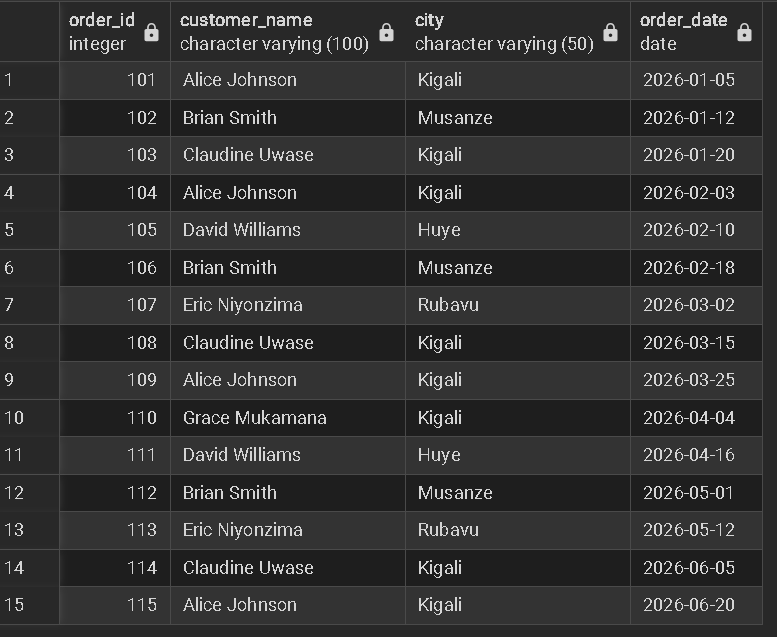
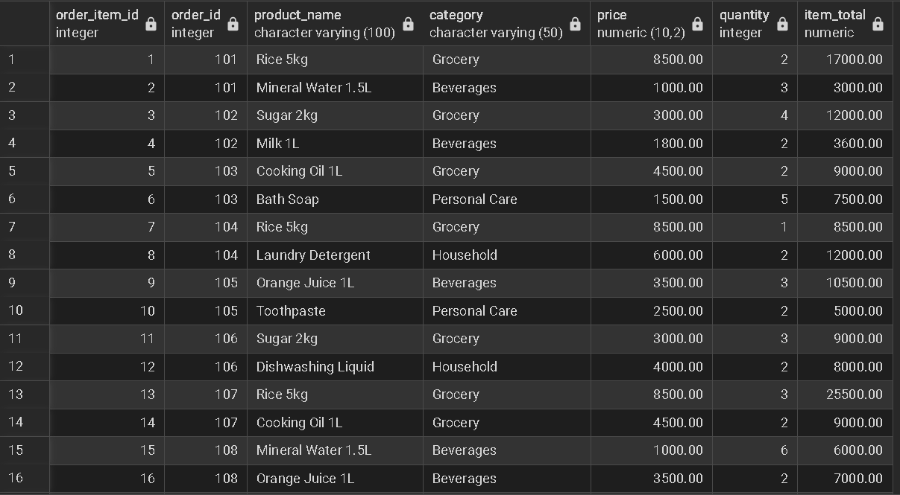
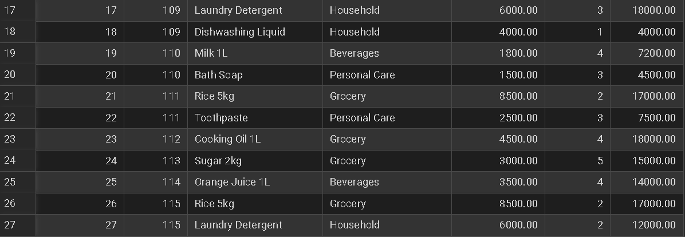
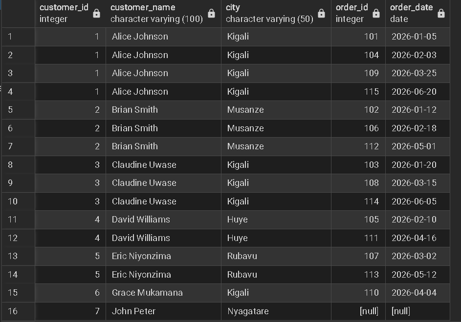
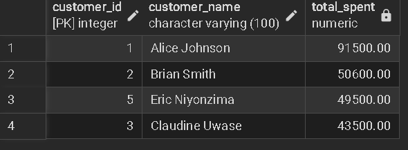
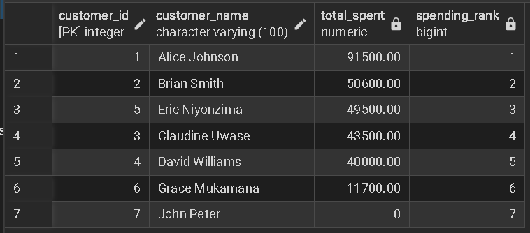
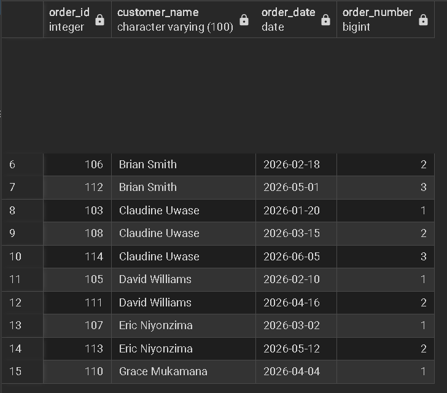
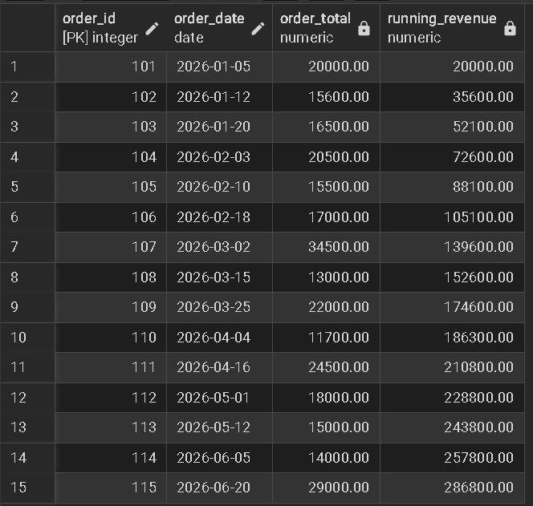
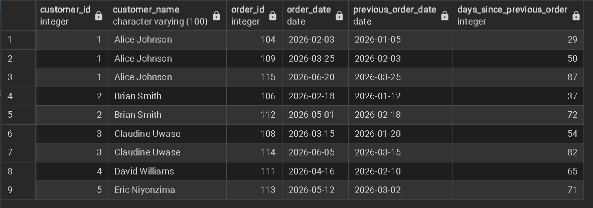

# Sunrise Supermarket Database Project

## 1. Student Information

**Student Name:** LOKO Ezonsou Eldad
**Student ID:** 28201 
**Database System:** PostgreSQL  
**Database Tool:** pgAdmin 4  
**Database Name:** `sunrise_supermarket`


## 2. Business Scenario

Sunrise Supermarket sells products to customers who place orders containing one or more products. Management wants to understand who their customers are, what they buy, how much they spend, and how sales change over time.

This project uses a relational PostgreSQL database to store customer information, products, orders, and order items. SQL JOINs, Common Table Expressions (CTEs), and window functions are used to analyze the supermarket's sales data.


## 3. Database Tables

The database contains four main tables:
# QUERRY
CREATE TABLE customers (
    customer_id INTEGER PRIMARY KEY,
    customer_name VARCHAR(100),
    email VARCHAR(100),
    city VARCHAR(50)
);

CREATE TABLE products (
    product_id INTEGER PRIMARY KEY,
    product_name VARCHAR(100),
    category VARCHAR(50),
    price NUMERIC(10,2)
);

CREATE TABLE orders (
    order_id INTEGER PRIMARY KEY,
    customer_id INTEGER REFERENCES customers(customer_id),
    order_date DATE
);

CREATE TABLE order_items (
    order_item_id INTEGER PRIMARY KEY,
    order_id INTEGER REFERENCES orders(order_id),
    product_id INTEGER REFERENCES products(product_id),
    quantity INTEGER
);

### Customers

Stores information about supermarket customers.

- `customer_id` - Primary key
- `customer_name` - Customer's name
- `email` - Customer email address
- `city` - Customer's city
# QUERRY
INSERT INTO customers
    (customer_id, customer_name, email, city)
VALUES
    (1, 'Alice Johnson', 'alice@gmail.com', 'Kigali'),
    (2, 'Brian Smith', 'brian@gmail.com', 'Musanze'),
    (3, 'Claudine Uwase', 'claudine@gmail.com', 'Kigali'),
    (4, 'David Williams', 'david@gmail.com', 'Huye'),
    (5, 'Eric Niyonzima', 'eric@gmail.com', 'Rubavu'),
    (6, 'Grace Mukamana', 'grace@gmail.com', 'Kigali'),
    (7, 'John Peter', 'john@gmail.com', 'Nyagatare');

### Products

Stores information about products sold by the supermarket.

- `product_id` - Primary key
- `product_name` - Product name
- `category` - Product category
- `price` - Product price
# QUERRY
INSERT INTO products
    (product_id, product_name, category, price)
VALUES
    (1, 'Rice 5kg', 'Grocery', 8500.00),
    (2, 'Sugar 2kg', 'Grocery', 3000.00),
    (3, 'Cooking Oil 1L', 'Grocery', 4500.00),
    (4, 'Mineral Water 1.5L', 'Beverages', 1000.00),
    (5, 'Orange Juice 1L', 'Beverages', 3500.00),
    (6, 'Milk 1L', 'Beverages', 1800.00),
    (7, 'Laundry Detergent', 'Household', 6000.00),
    (8, 'Dishwashing Liquid', 'Household', 4000.00),
    (9, 'Toothpaste', 'Personal Care', 2500.00),
    (10, 'Bath Soap', 'Personal Care', 1500.00);

### Orders

Stores information about customer orders.

- `order_id` - Primary key
- `customer_id` - Foreign key referencing `customers`
- `order_date` - Date the order was placed
# QUERRY
INSERT INTO orders
    (order_id, customer_id, order_date)
VALUES
    (101, 1, '2026-01-05'),
    (102, 2, '2026-01-12'),
    (103, 3, '2026-01-20'),
    (104, 1, '2026-02-03'),
    (105, 4, '2026-02-10'),
    (106, 2, '2026-02-18'),
    (107, 5, '2026-03-02'),
    (108, 3, '2026-03-15'),
    (109, 1, '2026-03-25'),
    (110, 6, '2026-04-04'),
    (111, 4, '2026-04-16'),
    (112, 2, '2026-05-01'),
    (113, 5, '2026-05-12'),
    (114, 3, '2026-06-05'),
    (115, 1, '2026-06-20');

### Order Items

Stores the individual products included in each order.

- `order_item_id` - Primary key
- `order_id` - Foreign key referencing `orders`
- `product_id` - Foreign key referencing `products`
- `quantity` - Quantity purchased
# QUERRY
INSERT INTO order_items
    (order_item_id, order_id, product_id, quantity)
VALUES
    (1, 101, 1, 2),
    (2, 101, 4, 3),

    (3, 102, 2, 4),
    (4, 102, 6, 2),

    (5, 103, 3, 2),
    (6, 103, 10, 5),

    (7, 104, 1, 1),
    (8, 104, 7, 2),

    (9, 105, 5, 3),
    (10, 105, 9, 2),

    (11, 106, 2, 3),
    (12, 106, 8, 2),

    (13, 107, 1, 3),
    (14, 107, 3, 2),

    (15, 108, 4, 6),
    (16, 108, 5, 2),

    (17, 109, 7, 3),
    (18, 109, 8, 1),

    (19, 110, 6, 4),
    (20, 110, 10, 3),

    (21, 111, 1, 2),
    (22, 111, 9, 3),

    (23, 112, 3, 4),

    (24, 113, 2, 5),

    (25, 114, 5, 4),

    (26, 115, 1, 2),
    (27, 115, 7, 2);

### Relationship

The tables are related as follows:

`customers` → `orders` → `order_items` → `products`

This design avoids unnecessary duplication and allows customer, order, and product information to be analyzed together.


## 4. Sample Data

The database was populated with realistic sample data containing:

- **7 customers**
- **10 products**
- **4 product categories**
- **15 orders**
- **27 order items**
- Orders distributed across multiple dates from January to June 2026

The product categories include:

- Grocery
- Beverages
- Household
- Personal Care

One customer was intentionally left without an order so that the LEFT JOIN requirement could be demonstrated.


# 5. SQL Queries and Explanations

## Question 1 — Orders with Customer Information

### Query

```sql
SELECT
    o.order_id,
    c.customer_name,
    c.city,
    o.order_date
FROM orders AS o
INNER JOIN customers AS c
    ON o.customer_id = c.customer_id
ORDER BY o.order_date;
```

### Explanation

This query uses an **INNER JOIN** to connect the `orders` table with the `customers` table using `customer_id`.

It displays every order together with:

- Order ID
- Customer name
- Customer city
- Order date

Only orders that have a matching customer are returned.

**Screenshot:**  



## Question 2 — Order Items and Product Information

### Query

```sql
SELECT
    oi.order_item_id,
    oi.order_id,
    p.product_name,
    p.category,
    p.price,
    oi.quantity,
    oi.quantity * p.price AS item_total
FROM order_items AS oi
INNER JOIN products AS p
    ON oi.product_id = p.product_id
ORDER BY oi.order_id, oi.order_item_id;
```

### Explanation

This query joins `order_items` with `products` using `product_id`.

It displays the product name, category, price, quantity ordered, and the total value of each order item.

The expression:

```sql
oi.quantity * p.price
```

calculates the revenue generated by that particular item.

**Screenshot:**  



## Question 3 — All Customers Including Customers Without Orders

### Query

```sql
SELECT
    c.customer_id,
    c.customer_name,
    c.city,
    o.order_id,
    o.order_date
FROM customers AS c
LEFT JOIN orders AS o
    ON c.customer_id = o.customer_id
ORDER BY c.customer_id, o.order_date;
```

### Explanation

This query uses a **LEFT JOIN** so that every customer appears, even if the customer has never placed an order.

Customers without orders have `NULL` values for `order_id` and `order_date`.

This demonstrates why a LEFT JOIN is useful when management wants a complete list of customers.

**Screenshot:**  


## Question 4 — Customers Spending Above Average

### Query

```sql
WITH customer_totals AS (
    SELECT
        c.customer_id,
        c.customer_name,
        COALESCE(SUM(oi.quantity * p.price), 0) AS total_spent
    FROM customers AS c
    LEFT JOIN orders AS o
        ON c.customer_id = o.customer_id
    LEFT JOIN order_items AS oi
        ON o.order_id = oi.order_id
    LEFT JOIN products AS p
        ON oi.product_id = p.product_id
    GROUP BY
        c.customer_id,
        c.customer_name
)
SELECT
    customer_id,
    customer_name,
    total_spent
FROM customer_totals
WHERE total_spent > (
    SELECT AVG(total_spent)
    FROM customer_totals
)
ORDER BY total_spent DESC;
```

### Explanation

This query uses a **Common Table Expression (CTE)** named `customer_totals`.

The CTE calculates the total amount spent by each customer using:

```sql
SUM(oi.quantity * p.price)
```

The main query then calculates the average customer spending and returns only customers whose total spending is greater than the average.

`COALESCE` changes NULL totals into zero for customers who have not placed an order.

**Screenshot:**  


## Question 5 — Rank Customers by Total Spending

### Query

```sql
WITH customer_totals AS (
    SELECT
        c.customer_id,
        c.customer_name,
        COALESCE(SUM(oi.quantity * p.price), 0) AS total_spent
    FROM customers AS c
    LEFT JOIN orders AS o
        ON c.customer_id = o.customer_id
    LEFT JOIN order_items AS oi
        ON o.order_id = oi.order_id
    LEFT JOIN products AS p
        ON oi.product_id = p.product_id
    GROUP BY
        c.customer_id,
        c.customer_name
)
SELECT
    customer_id,
    customer_name,
    total_spent,
    RANK() OVER (
        ORDER BY total_spent DESC
    ) AS spending_rank
FROM customer_totals
ORDER BY spending_rank;
```

### Explanation

The `RANK()` window function ranks customers from the highest spender to the lowest spender.

The customer with the highest total spending receives rank 1.

This helps management identify the most valuable customers based on their spending.

**Screenshot:**  


## Question 6 — Number Each Customer's Orders

### Query

```sql
SELECT
    o.order_id,
    c.customer_name,
    o.order_date,
    ROW_NUMBER() OVER (
        PARTITION BY o.customer_id
        ORDER BY o.order_date
    ) AS order_number
FROM orders AS o
INNER JOIN customers AS c
    ON o.customer_id = c.customer_id
ORDER BY c.customer_name, o.order_date;
```

### Explanation

The `ROW_NUMBER()` window function gives each customer's orders a sequential number based on the order date.

`PARTITION BY o.customer_id` means the numbering starts again for each customer.

For example, a customer's first order receives 1, their second order receives 2, and so on.

**Screenshot:**  


## Question 7 — Running Total of Revenue Over Time

### Query

```sql
WITH order_revenue AS (
    SELECT
        o.order_id,
        o.order_date,
        SUM(oi.quantity * p.price) AS order_total
    FROM orders AS o
    INNER JOIN order_items AS oi
        ON o.order_id = oi.order_id
    INNER JOIN products AS p
        ON oi.product_id = p.product_id
    GROUP BY
        o.order_id,
        o.order_date
)
SELECT
    order_id,
    order_date,
    order_total,
    SUM(order_total) OVER (
        ORDER BY order_date, order_id
        ROWS BETWEEN UNBOUNDED PRECEDING AND CURRENT ROW
    ) AS running_revenue
FROM order_revenue
ORDER BY order_date, order_id;
```

### Explanation

The CTE first calculates the total revenue generated by each order.

The window function:

```sql
SUM(order_total) OVER (...)
```

then calculates the cumulative revenue over time.

The results are ordered by order date, allowing management to see how total revenue grows throughout the period.

**Screenshot:**  


## Question 8 — Days Between Customer Orders

### Query

```sql
WITH customer_orders AS (
    SELECT
        o.order_id,
        o.customer_id,
        c.customer_name,
        o.order_date,
        LAG(o.order_date) OVER (
            PARTITION BY o.customer_id
            ORDER BY o.order_date
        ) AS previous_order_date
    FROM orders AS o
    INNER JOIN customers AS c
        ON o.customer_id = c.customer_id
)
SELECT
    customer_id,
    customer_name,
    order_id,
    order_date,
    previous_order_date,
    order_date - previous_order_date AS days_since_previous_order
FROM customer_orders
WHERE previous_order_date IS NOT NULL
ORDER BY customer_name, order_date;
```

### Explanation

The `LAG()` window function retrieves the previous order date for each customer.

Subtracting the previous order date from the current order date calculates the number of days between consecutive orders.

The first order for each customer is excluded because there is no previous order date.

This analysis can help management understand customer purchasing frequency.

**Screenshot:**  


# 6. Business Interpretation

The database analysis provides useful information for Sunrise Supermarket management.

### Customer behavior

The customer spending analysis identifies customers who spend more than the average. These customers may be considered high-value customers and could be targeted with loyalty rewards, discounts, or personalized promotions.

### Customer ranking

The `RANK()` analysis allows management to quickly identify the highest-spending customers. This can support customer retention strategies.

### Product sales

The order item analysis shows which products customers purchase and how much revenue each product generates. Management can use this information to make better inventory and product-promotion decisions.

### Sales trends

The running revenue analysis shows how revenue accumulates over time. Management can use this to identify periods of stronger or weaker sales.

### Customer purchasing frequency

The `LAG()` analysis shows the number of days between repeat purchases. Customers with long gaps between orders may benefit from targeted reminders or promotional offers.

### Inactive customers

The LEFT JOIN analysis identifies customers who have not placed an order. These customers can be targeted with marketing campaigns designed to encourage their first purchase.

---

# 7. Challenges Encountered and Solutions

### Challenge 1 — Oracle syntax versus PostgreSQL

The original assignment describes Oracle data types such as `NUMBER` and `VARCHAR2`. Since this project was implemented using PostgreSQL in pgAdmin 4, PostgreSQL-compatible types were used instead.

For example:

```text
NUMBER       → INTEGER / NUMERIC
VARCHAR2     → VARCHAR
```

### Challenge 2 — Customers without orders

A normal INNER JOIN would remove customers who do not have orders. A LEFT JOIN was therefore used to keep all customers in the result.

### Challenge 3 — Calculating customer totals

Customer spending requires combining quantities and product prices across multiple tables. A CTE was used to calculate each customer's total before comparing it with the average.

### Challenge 4 — Window functions

Window functions such as `RANK()`, `ROW_NUMBER()`, and `LAG()` were used to perform ranking, sequencing, and previous-row analysis without losing the individual rows from the result.


# 8. Conclusion

The Sunrise Supermarket database demonstrates how PostgreSQL can be used to store and analyze supermarket sales data.

The project demonstrates:

- Relational database design
- Primary keys and foreign keys
- INNER JOIN
- LEFT JOIN
- Common Table Expressions (CTEs)
- Aggregate functions
- RANK()
- ROW_NUMBER()
- LAG()
- Running totals
- Date calculations

These SQL techniques provide management with useful information about customers, products, purchasing behavior, customer value, and revenue trends.

---

## 9. Query Results / Screenshots


Recommended screenshots:

1. Question 1 result

2. Question 2 result

3. Question 3 result showing the customer with no order

4. Question 4 result showing above-average customers

5. Question 5 result showing spending ranks

6. Question 6 result showing order numbers

7. Question 7 result showing running revenue

8. Question 8 result showing days between orders

